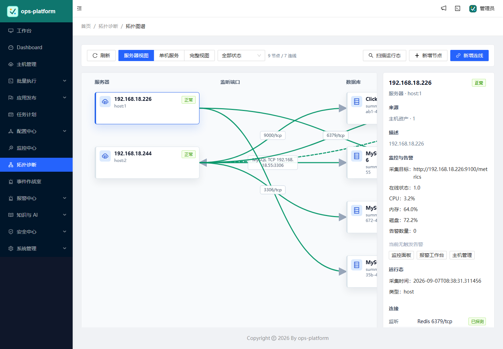
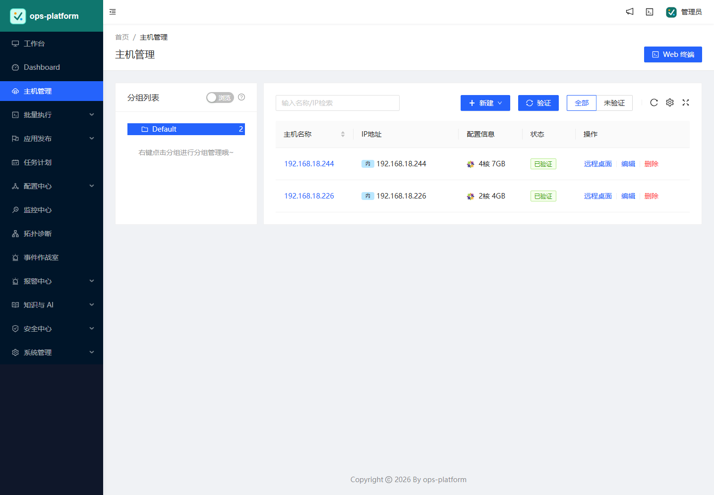
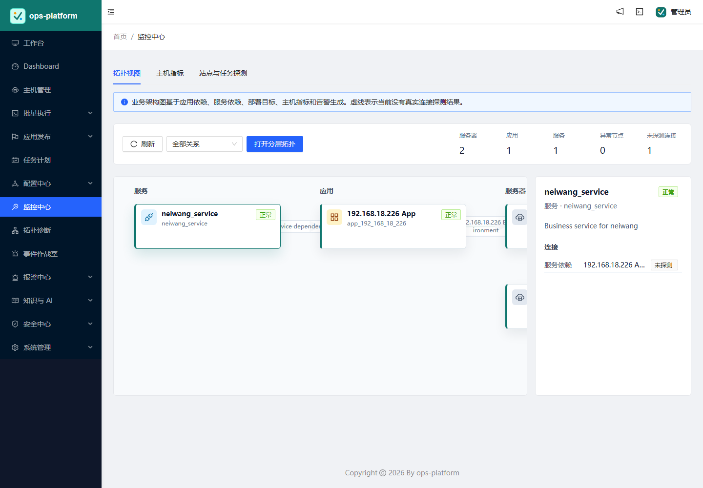
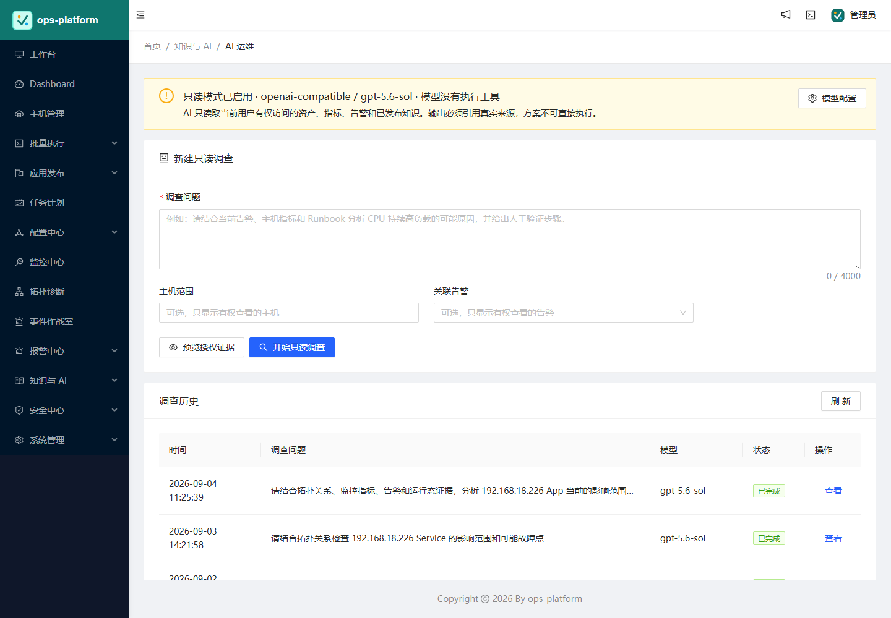

<h1 align="center">ops-platform</h1>

ops-platform 是面向私有化场景的智能运维平台，整合主机管理、在线终端、远程桌面、文件管理、应用发布、任务计划、配置中心、监控告警、业务拓扑、事件作战室、知识库和只读 AI 运维调查等能力。

## 项目版本

当前仓库正在建设私有化智能运维平台，开发中的预发布版本为 `ops-v0.1.0-alpha.41`（内部预发布版本）。现已完成资产凭据/身份/对象授权、高风险操作审批与防篡改审计；SFTP 支持分片续传、批量队列、校验、Range 下载和受审批在线编辑；RDP/VNC 通过 Apache Guacamole 接入短时一次性票据与二次授权；Prometheus/Alertmanager 提供主机指标、规则告警、恢复、认领和静默闭环；固定业务服务拓扑支持主机服务发现、人工确认、端口连通性探测和状态染色；事件作战室支持告警关联、影响面聚合、处置建议和审批执行记录；知识库提供空间角色、文档审批、不可覆盖版本和授权检索；AI 运维默认关闭，仅基于当前用户授权证据进行带引用的只读调查，不携带执行工具，管理员可在 AI 页面加密配置 OpenAI 或 Anthropic 原生格式的模型服务和密钥。

- [建设蓝图](docs/OPS_PLATFORM_BLUEPRINT.md)
- [M1 资产与授权说明](docs/M1_ASSET_ACCESS.md)
- [M1 审批与审计说明](docs/M1_APPROVAL_AUDIT.md)
- [M2 SFTP 续传与清理说明](docs/M2_RESUMABLE_SFTP.md)
- [M3 RDP/VNC 安全接入](docs/M3_REMOTE_DESKTOP.md)
- [M4 主机监控与告警闭环](docs/M4_OBSERVABILITY.md)
- [M5 知识库与只读 AI 运维](docs/M5_KNOWLEDGE_AIOPS.md)
- [M6 AI 拓扑诊断与事件作战室](docs/M6_AI_TOPOLOGY_DIAGNOSIS.md)
- [安全验证基线](docs/SECURITY_BASELINE.md)
- [私有化 Docker 部署](docs/docker/README.md)
- [版本记录](CHANGELOG.md)

该预发布版本受旧技术栈漏洞阻断，只能用于隔离内网验证，不应直接暴露公网或作为正式生产版本。

## 功能截图

### 业务拓扑诊断

### 主机管理

### 监控中心

### AI 运维调查

## 特性

- **批量执行**: 主机命令在线批量执行
- **在线终端**: 主机支持浏览器在线终端登录
- **文件管理**: 主机文件在线上传下载
- **任务计划**: 灵活的在线任务计划
- **发布部署**: 支持自定义发布部署流程
- **配置中心**: 支持KV、文本、json等格式的配置
- **监控中心**: 支持主机指标、端口、进程、自定义规则和告警闭环
- **报警中心**: 支持短信、邮件、钉钉、微信等报警方式
- **业务拓扑**: 支持固定服务监控、跨主机依赖、端口探测和拓扑状态展示
- **事件作战室**: 支持告警关联、影响面分析、处置建议和审批执行记录
- **远程桌面**: 通过 Guacamole 接入 RDP/VNC
- **知识库与 AI 调查**: 基于授权证据进行只读问题分析
- **审计与审批**: 高风险操作审批、审计签名和操作留痕

## 环境

* Python 3.6
* Django 2.2
* Node 12.14
* React 16.11

## 安装

请参考 [私有化 Docker 部署](docs/docker/README.md) 和各里程碑文档。正式升级或部署前，应先在数据库副本和隔离网络中演练。
  
## License & Copyright
[AGPL-3.0](https://opensource.org/licenses/AGPL-3.0)
