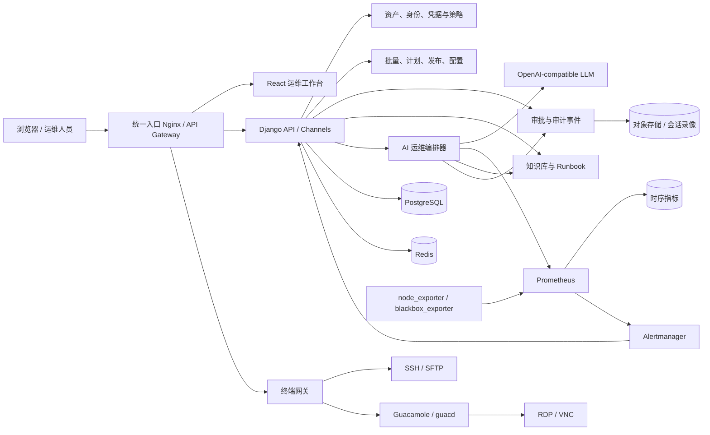

# 智能运维管理平台建设蓝图

## 1. 决策摘要

- 建设方式：基于现有 Spug 3.0 二次开发，保留已有数据与运维能力，不从零重写。
- 交付方式：分阶段交付，先形成可投入内部使用的 MVP，再扩展 RDP/VNC、完整可观测性和 AI 执行闭环。
- 验收方式：自动化测试、安全检查和部署验收必须同时通过。
- 部署假设：私有化部署、安全优先、先支持单集群 Docker Compose，后续兼容 Kubernetes 和高可用部署。
- AI 原则：默认只读；AI 只能生成诊断和执行计划，任何写操作必须经过权限校验、风险分级和人工审批。
- 安全现状：M0 过渡镜像仍受旧技术栈漏洞阻断，详见 [M0 安全验证基线](SECURITY_BASELINE.md)。

### 规划就绪度

| 维度 | 得分 | 状态 |
| --- | ---: | --- |
| 问题清晰度 | 27/30 | 已定义 |
| 功能范围 | 18/25 | 已定义 |
| 成功标准 | 18/20 | 已定义 |
| 约束条件 | 8/15 | 假设 |
| MVP 优先级 | 9/10 | 已定义 |
| 合计 | 80/100 | 可进入设计 |

尚待确认的约束包括生产规模、合规等级、数据保留周期、单点登录方式和可使用的大模型供应商。这些选择不阻塞 M0/M1，但会影响高可用、审计和 AI 模块的最终实现。

## 2. 现有能力与缺口

| 领域 | 现有 Spug 能力 | 建设目标 |
| --- | --- | --- |
| 资产管理 | 主机、树形主机组、基础主机信息 | 统一资产、凭据、身份、标签、授权和生命周期 |
| 在线终端 | 浏览器 SSH、xterm.js、SFTP | SSH/RDP/VNC 统一入口、会话录像、命令审计、主题与快捷键 |
| 文件管理 | SFTP 上传、下载、删除 | 分片、断点续传、批量传输、在线编辑、校验和与审批 |
| 批量操作 | 批量命令、模板、文件分发 | 并发控制、灰度批次、暂停/恢复、失败重试和回滚 |
| 计划任务 | cron/间隔任务、执行历史 | 时区、错过执行策略、并发策略、审批、审计和通知 |
| 发布部署 | 仓库、应用、发布申请 | 可视化流水线、环境门禁、制品、审批、回滚和验证 |
| 配置中心 | 环境、服务、应用配置 | KV/文本/JSON、Schema 校验、版本比较、审批和回滚 |
| 监控告警 | 站点、端口、Ping、进程、自定义命令 | CPU/内存/磁盘/网络时序指标、聚合告警、静默和升级策略 |
| 权限审计 | 用户、角色、页面/分组权限、登录日志 | 对象级权限、临时授权、双人审批、不可抵赖审计和会话证据 |
| 知识与 AI | 无 | 知识空间、Runbook、事件复盘、RAG 检索和受控 AI 运维 |

## 3. 目标架构



### 3.1 组件边界

1. Spug Core
   - 继续承担用户、主机、任务、发布、配置、通知和 WebSocket 基础能力。
   - 保持现有 API 可用，新增接口统一放在 `/api/v1/`。

2. 资产与权限域
   - 新增 `AssetGroup`、`Credential`、`Identity`、`AccessPolicy`、`AccessGrant`。
   - 现有 `Host` 作为第一种资产类型，先兼容再逐步迁移，不立即重写所有主机逻辑。

3. 终端网关
   - SSH/SFTP 保留现有实现并增加授权票据、会话元数据和录像接口。
   - RDP/VNC 通过 Apache Guacamole 接入，业务系统只签发短时连接票据，不把长期凭据交给浏览器。

4. 可观测性
   - Prometheus 保存主机和探测指标，Alertmanager 负责告警路由。
   - Spug 保存监控策略、资产关联、告警事件、认领状态和通知记录，不重复实现时序数据库。

5. 知识库与 AI
   - 知识库存储运维文档、Runbook、故障复盘和资产说明。
   - AI 编排器只访问受权限约束的工具，不直接拥有数据库、SSH 私钥或任意 Shell 权限。

## 4. 核心数据模型

### 4.1 资产和凭据

- `AssetGroup`：树形分组、负责人、环境、标签和继承策略。
- `Asset`：资产类型、名称、地址、状态、来源和扩展属性。
- `Credential`：SSH 密钥、密码、RDP/VNC 凭据或 API Token 的加密载体。
- `Identity`：连接用户名、协议、默认凭据、提权方式和使用约束。
- `AssetIdentityBinding`：资产、身份与凭据之间的多对多绑定。
- `AccessPolicy`：主体、动作、资源范围、环境、时间窗和风险等级。
- `AccessGrant`：长期或临时授权，包含审批、有效期和撤销状态。

凭据采用信封加密：每条凭据使用独立数据密钥和 AES-GCM，加密数据密钥由环境主密钥、KMS 或 Vault 保护。API 永不返回可逆明文，执行器只在内存中短时解密。

### 4.2 审批与审计

- `ApprovalRequest`：请求人、动作、目标、风险、变更摘要、回滚方案和审批链。
- `AuditEvent`：只追加事件，包含操作者、来源 IP、对象、动作、结果、关联 ID 和哈希。
- `TerminalSession`：协议、资产、身份、开始/结束时间、客户端信息和录像地址。
- `CommandRecord`：会话或批量任务中的命令、退出码、输出摘要和敏感字段脱敏结果。
- `ExecutionEvidence`：变更前快照、执行日志、验证结果和回滚结果。

所有高风险操作共享一个 `correlation_id`，串联告警、AI 调查、审批、执行和复盘。

### 4.3 知识与 AI

- `KnowledgeSpace`：团队、权限和数据保留策略。
- `KnowledgeDocument`：Markdown/文本/附件、版本、标签和审核状态。
- `Runbook`：适用告警、前置检查、步骤、验证和回滚。
- `Incident`：告警聚合、影响资产、时间线、负责人和结论。
- `AIInvestigation`：输入证据、引用来源、模型、提示版本和诊断输出。
- `AIActionPlan`：结构化步骤、风险、目标、预计影响和回滚方案。
- `AIExecution`：审批后的执行实例及逐步验证结果。

## 5. AI 运维安全闭环

```text
发现 Observe
  → 诊断 Diagnose
  → 提案 Propose
  → 权限与风险校验 Guard
  → 人工审批 Approve
  → 分批执行 Execute
  → 自动验证 Verify
  → 回滚或沉淀 Learn
```

强制规则：

- 默认只读，第一阶段 AI 只能查询资产、指标、告警、日志摘要和知识库。
- AI 输出必须引用证据来源，并区分事实、推断和未知信息。
- 主机返回内容、日志和知识文档都视为不可信输入，必须防范提示注入。
- 写操作只能使用白名单工具和结构化参数，禁止把 AI 文本直接拼接成 Shell 命令。
- 执行前展示目标范围、命令预览、并发数、超时、验证和回滚方案。
- 高风险操作要求双人审批；紧急授权有最短有效期并触发额外告警。
- 每一步具备幂等键，失败时停止扩散；默认按小批量灰度执行。

## 6. 信息架构与交互

主导航采用工作场景而不是技术组件堆叠：

1. 工作台：待处理告警、待审批、运行任务、资产健康和近期变更。
2. 资产中心：资产树、身份与凭据、授权策略、连接入口。
3. 操作中心：在线终端、文件管理、批量执行、快捷命令。
4. 交付中心：应用、流水线、发布申请、制品和回滚。
5. 自动化：计划任务、配置中心、Runbook。
6. 可观测性：主机指标、站点/端口/进程、自定义监控、告警事件。
7. 知识与 AI：知识空间、故障调查、AI 提案、执行证据和复盘。
8. 安全中心：用户、角色、策略、审批、会话录像和审计日志。

关键交互：

- “事件作战室”：从一条告警直接查看受影响资产、指标、近期变更、Runbook、终端和 AI 诊断。
- “变更护照”：每次高风险操作展示申请、审批、目标、执行、验证和回滚的完整证据链。
- “命令面板”：统一搜索资产、Runbook、快捷命令和页面，但只展示用户有权访问的结果。
- 全局风险标识：读取、低风险变更、高风险变更使用一致的颜色和确认方式。

## 7. 分阶段实施计划

### M0：安全与工程基线

目标：让现有系统具备继续开发和私有化试运行的安全条件。

- 将 `SECRET_KEY`、`DEBUG`、`ALLOWED_HOSTS`、数据库和 Redis 配置迁移到环境变量或 Secret。
- 移除 Docker Compose 中的默认数据库口令和不必要的 `privileged` 权限。
- 建立依赖升级路线，优先升级已停止安全维护的 Django、React、Axios 等组件。
- 增加 PostgreSQL/MariaDB、Redis、API、WebSocket 和任务 Worker 健康检查。
- 增加数据库备份/恢复脚本、日志轮转、迁移检查和基础 CI。
- 建立测试基线、秘密扫描、依赖审计和 AGPL 合规说明。

验收：生产模式不含硬编码密钥；默认配置不能以弱口令启动；健康检查和备份恢复演练通过；基础测试与扫描可重复执行。

### M1：可用 MVP

目标：内部运维团队可以安全地完成日常 Linux 主机操作。

- 资产分组、标签、凭据、身份和对象级授权。
- 迁移现有主机私钥到加密凭据，保留兼容读取并提供回滚窗口。
- SSH 终端、SFTP、批量命令、文件分发、计划任务、发布和配置中心接入统一授权。
- 增加审批、审计事件、任务证据和操作关联 ID。
- 配置中心增加版本比较、JSON 校验和一键回滚。
- 建立知识空间、Markdown 文档和 Runbook。
- AI 提供只读告警摘要、指标解释、知识检索和处置建议，不允许执行。

验收：不同角色和资产范围不能越权；凭据不以明文落库或返回前端；关键操作可从审计日志完整还原；现有 Spug 核心流程兼容。

当前进度：已完成资产凭据/身份/绑定/对象授权的后端纵向链路，以及 SSH、SFTP、批量、计划、监控和发布的执行前授权；已增加高风险操作双人审批、一次性批准票据、关联 ID、HMAC 审计链和审批/审计管理页面，并接入批量命令、SSH 文件上传/删除、文件分发、计划任务及原有发布审批事件。任务证据、配置中心增强、知识库与只读 AI 仍在开发。实现说明见 [M1 资产、凭据与对象授权](M1_ASSET_ACCESS.md) 和 [M1 高风险操作审批与审计](M1_APPROVAL_AUDIT.md)。

### M2：远程访问与大文件

- 集成 Guacamole，提供 RDP/VNC 和统一短时连接票据。
- 增加 SSH/RDP/VNC 会话录像、回放授权和保留周期。
- SFTP 增加分片、断点续传、SHA-256 校验、批量队列、冲突策略和在线编辑锁。
- 快捷命令、自定义快捷键和主题按用户保存。

验收：浏览器不接触长期凭据；连接过期自动失效；大文件中断后可续传；录像只对授权审计员可见。

### M3：可观测性与告警闭环

- 集成 Prometheus、node_exporter、blackbox_exporter 和 Alertmanager。
- 增加 CPU、内存、磁盘、网络、负载和进程指标页面。
- 告警支持聚合、抑制、静默、认领、升级和恢复通知。
- 接入邮件、短信、钉钉、企业微信等渠道，并记录每次投递结果。

验收：指标采集失败可见；告警风暴受控；告警、资产、近期变更和负责人可关联；恢复通知与投递证据完整。

### M4：受控 AI 执行

- AI 基于告警和知识库生成结构化调查与执行计划。
- 提供只读诊断工具、白名单变更工具、审批门禁、灰度执行和自动验证。
- 高风险变更支持双人审批、停止扩散、自动回滚和事后复盘。
- 将验证通过的处理过程转为待审核 Runbook 草稿。

验收：无审批不能执行写操作；越权和提示注入测试通过；每次执行都有引用、审批、命令、输出、验证和回滚证据。

## 8. 代码落点

后端建议新增：

- `spug_api/apps/assets/`：资产、凭据、身份、授权策略。
- `spug_api/apps/audit/`：审批、审计、终端会话和执行证据。
- `spug_api/apps/knowledge/`：知识空间、文档和 Runbook。
- `spug_api/apps/aiops/`：调查、计划、工具权限和执行编排。
- `spug_api/apps/observability/`：Prometheus/Alertmanager 适配和告警事件。
- `spug_api/apps/gateway/`：Guacamole 短时票据和会话生命周期。

前端建议新增：

- `spug_web/src/pages/assets/`
- `spug_web/src/pages/operations/`
- `spug_web/src/pages/observability/`
- `spug_web/src/pages/knowledge/`
- `spug_web/src/pages/aiops/`
- `spug_web/src/pages/security/`

接口统一采用 `/api/v1/`，新增对象使用 UUID，对外响应包含 `request_id`，异步执行返回可查询的任务 ID。

## 9. 测试与验收策略

### 自动化测试

- 单元测试：权限决策、加解密、风险分级、告警聚合、AI 工具参数校验。
- 集成测试：数据库迁移、Redis 队列、SSH/SFTP 测试容器、Guacamole、Prometheus 和对象存储。
- 端到端测试：资产授权、终端登录、文件续传、批量灰度、审批发布、告警闭环和 AI 只读调查。
- 兼容测试：现有 Host、Group、Role、任务、发布和配置数据迁移前后结果一致。

### 安全检查

- 秘密扫描、依赖漏洞、SAST、容器镜像和 IaC 扫描。
- IDOR、越权、CSRF、WebSocket 鉴权、票据重放和会话固定测试。
- 凭据加密、密钥轮换、审计防篡改、录像访问和数据脱敏测试。
- AI 提示注入、工具越权、参数逃逸、范围扩大和审批绕过测试。

### 部署验收

- 全新安装、滚动升级、数据库迁移、备份恢复和灾难恢复演练。
- API、WebSocket、Worker、Scheduler、Prometheus、Guacamole 和对象存储健康检查。
- 关键组件不可用时系统应降级而不是放大故障；AI 或指标系统不可用不得影响人工运维。

## 10. 风险与缓解

| 风险 | 影响 | 可能性 | 缓解措施 |
| --- | --- | --- | --- |
| Django 2.2、React 16 和旧依赖停止维护 | 高 | 高 | M0 建立升级分支和回归矩阵，新高风险模块不继续绑定旧接口 |
| 私钥明文和硬编码生产配置 | 高 | 高 | M0/M1 完成 Secret 外置、信封加密、迁移校验和密钥轮换 |
| RDP/VNC 引入新的暴露面 | 高 | 中 | Guacamole 隔离部署、短时票据、网络分区、录像和速率限制 |
| AI 误操作或被日志提示注入 | 高 | 中 | 默认只读、结构化工具、人工审批、最小权限、灰度与自动回滚 |
| 持续主机指标破坏“无 Agent”特性 | 中 | 高 | 允许 node_exporter 与 SSH 轮询两种模式，明确能力和成本差异 |
| 大版本一次上线导致迁移失败 | 高 | 中 | 双写/回填/校验/切读/清理的分阶段迁移，不做不可逆一步切换 |
| 会话录像和日志增长过快 | 中 | 高 | 对象存储、生命周期策略、压缩、配额和按合规要求保留 |
| AGPL 合规遗漏 | 中 | 中 | 保留版权与许可证，提供对应源码和二开说明，商业分发前法律复核 |

## 11. 规划质量审查

外部 `designer`、`inspiration` 和 `reviewer` 通道未挂载，本轮采用同一评分维度进行本地降级审查。

| 维度 | 得分 | 依据 |
| --- | ---: | --- |
| 清晰度 | 9/10 | 架构边界、阶段、数据模型和强制规则明确 |
| 完整性 | 9/10 | 覆盖全部功能、迁移、测试、部署、合规和 AI 安全 |
| 可行性 | 8/10 | 最大不确定性是旧框架升级与生产规模 |
| 风险评估 | 9/10 | 识别凭据、远程访问、AI、迁移和存储风险并给出门禁 |
| 需求对齐 | 9/10 | 所有用户需求均映射到现有能力或具体里程碑 |
| 综合 | 8.8/10 | 通过，允许进入 M0 |

进入 M0 前不需要再确认功能范围；生产部署前必须补充规模、域名/TLS、SSO、通知渠道、模型供应商和数据保留周期。
